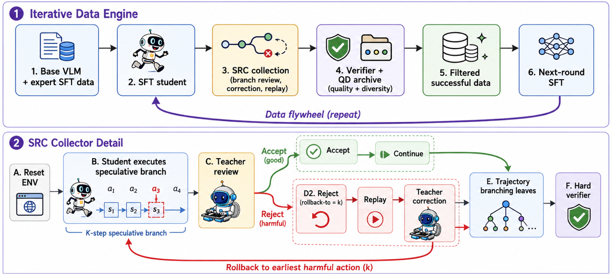

<p align="center">
  
</p>

<h1 align="center">Speculative Rollback Correction (SRC)</h1>
<h3 align="center">A Branch-Level Imitation Learning Framework for Quality-Diverse Web Agent Training</h3>

<p align="center">
  <a href="https://github.com/LongkunHao/SRC_gui_agent"></a>
</p>

This repository contains the official implementation of **Speculative Rollback Correction (SRC)**, a branch-level imitation framework for resettable GUI agent environments.

Instead of requesting teacher labels at every visited state or correcting only after a completed trajectory, SRC uses **fixed-horizon branch review**: the student executes a short speculative segment before teacher review, and the teacher localizes the first harmful deviation only when local progress breaks. Rollback preserves useful prefixes, while successful rollouts are filtered by a hard verifier and retained in a lightweight **quality-diversity archive**.

## Framework

```
Task x
  │
  ▼
┌─────────────────────────────────────┐
│  Student rolls out K-step branch    │
└──────────────┬──────────────────────┘
               │
               ▼
┌─────────────────────────────────────┐
│  Teacher reviews branch             │
│  → ACCEPT: commit branch            │
│  → REJECT at j: rollback to j       │
└──────────────┬──────────────────────┘
               │
     ┌─────────┴─────────┐
     │ ACCEPT             │ REJECT
     ▼                    ▼
  Continue         ┌──────────────┐
  rollout          │ Reset & Replay│
                   │ to rollback   │
                   │ point         │
                   └──────┬───────┘
                          │
                          ▼
                   ┌──────────────┐
                   │ Teacher      │
                   │ correction   │
                   └──────┬───────┘
                          │
                          ▼
                   Resume student
                   rollout
               │
               ▼
┌─────────────────────────────────────┐
│  Hard Verifier: pass / fail         │
└──────────────┬──────────────────────┘
               │ pass
               ▼
┌─────────────────────────────────────┐
│  Quality-Diversity Archive          │
│  (length × action × intervention)   │
└──────────────┬──────────────────────┘
               │
               ▼
  SFT training data: D_corr ∪ D_arc
```

## Project Structure

```
SRC_gui_agent/
├── src/                         # SRC framework (core)
│   ├── rollout_agent.py         # Speculative rollback correction agent
│   ├── teacher_review.py        # Teacher branch review & correction
│   ├── qd_archive.py           # Quality-diversity trajectory archive
│   ├── vision_agents.py        # Vision-based agent implementations (Qwen, Gemini, Claude, Kimi)
│   ├── agents.py               # Agent interface protocol
│   ├── tasks.py                # Task loading & verification
│   ├── server.py               # Environment server management
│   ├── run_rollout.py          # SRC data collection entry point
│   ├── run_eval.py             # Standard evaluation entry point
│   ├── report.py               # HTML report generation
│   ├── viz_rollout.py          # SRC trajectory visualization
│   ├── llm_trace.py            # LLM API call tracing
│   └── prompts/                # Teacher prompt templates
│
├── webarena_infinity/           # WebArena-Infinity benchmark (auxiliary)
│   ├── apps/                   # Generated web environments
│   ├── pipeline.py             # Environment generation pipeline
│   ├── docs/                   # Environment & task design guides
│   └── setup/                  # AWS infrastructure scripts
│
└── bench/                       # Analysis & dataset tools
    ├── dataset/                # Trajectory dataset builder
    └── analysis/               # Result plotting & ablation scripts
```

## Installation

Requires Python 3.12+ and [`uv`](https://docs.astral.sh/uv/getting-started/installation/).

```bash
git clone https://github.com/LongkunHao/SRC_gui_agent.git
cd SRC_gui_agent
bash setup.sh
```

Configure API keys:

```bash
cp .env.example .env
# Fill in your API keys in .env
```

## Usage

### SRC Data Collection (Rollout)

Run the speculative rollback correction loop to collect training data:

```bash
python src/run_rollout.py \
    --workers 4 \
    --K 3 \
    --max-interventions 6 \
    --web-app webarena_infinity/apps/gmail \
    --teacher-base-url http://localhost:9002/v1 \
    --teacher-model Qwen3.6-27B
```

Key arguments:
- `--K`: Speculative branch horizon (default: 3)
- `--max-interventions`: Teacher intervention budget per task (default: 6)
- `--branching`: Enable multi-leaf forking for diverse solution discovery
- `--max-forks`, `--max-leaves`: Branching budget control

### Standard Evaluation

Evaluate an agent against WebArena-Infinity tasks:

```bash
python src/run_eval.py \
    --model qwen \
    --difficulty easy \
    --workers 4 \
    --web-app webarena_infinity/apps/gmail
```

### Visualize SRC Trajectories

Generate interactive HTML visualizations of collected rollouts:

```bash
python src/viz_rollout.py <run_dir>
```

## Key Components

| Component | File | Description |
|-----------|------|-------------|
| **Rollout Agent** | `src/rollout_agent.py` | K-step speculative branch execution with teacher-guided rollback and replay |
| **Teacher Reviewer** | `src/teacher_review.py` | VLM-based branch review (accept/reject) and corrective action generation |
| **QD Archive** | `src/qd_archive.py` | Multidimensional binning archive (length × action type × interventions) |
| **Vision Agents** | `src/vision_agents.py` | Pluggable VLM agent implementations (Qwen, Gemini, Claude, Kimi) |

## Citation

Coming soon.

## License

This project is released under the MIT License.
